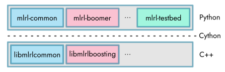

.. _structure:

Project Structure
-----------------

The BOOMER algorithm follows a unified framework for the implementation of different kinds of multi-label rule learning algorithms. Due to its modularity, different implementations can be used for the various aspects of the algorithm. This enables to flexibly adjust the algorithm to different datasets and use cases. For example, several approximation techniques, such as sampling methods, are available. Whereas such methods usually come with a minor deterioration in terms of predictive accuracy, they are often indispensable in cases where large datasets should be handled. An overview of the parameters that may be used to configure the BOOMER algorithm is provided in the :ref:`parameters` section.

Furthermore, the algorithm's implementation is split into several components. For maximum efficiency, all aspects of the core algorithm are written in `C++ <https://en.wikipedia.org/wiki/C%2B%2B>`__. To provide a user-friendly interface and to integrate the algorithm with the widely used `scikit-learn <https://scikit-learn.org>`__ framework, a `Python <https://en.wikipedia.org/wiki/Python_(programming_language)>`__ API is provided. It relies on the `Cython <https://en.wikipedia.org/wiki/Cython>`__ programming language to interact with the underlying C++ implementation. A schematic depiction of the project's structure is shown in the following.

By providing a shared library that implements the algorithmic aspects, all multi-label rule learning algorithms have in common ("libmlrlcommon"), the implementation of different types of learning methods ("libmlrlboosting" and possibly others) is facilitated. This is especially relevant for developers or scientists who want to build upon BOOMER's source code for developing novel machine learning approaches (see :ref:`cppapi`). The low-level libraries are used by higher-level Python modules. Again, this includes a module that provides common functionality ("mlrl-common"), as well as modules that correspond to specific instantiations of different learning algorithms ("mlrl-boomer" and possibly others). For further information on the available Python modules, refer to the :ref:`pythonapi`.

The application of machine learning methods, as well as scientific research in this area, typically requires to evaluate and compare the performance of different kinds of learning approaches, to identify optimal parameter settings for a particular use case, or to analyze the decisions that are made by a previously trained model. To reduce the burden that comes with such tasks, this project also includes a Python module that allows to perform experiments using the BOOMER algorithm via a command line API. It provides means for parameter tuning and eases to collect experimental results in terms of commonly used evaluation measures or the characteristics of models or datasets. Information on how to use these tools can be found in the :ref:`testbed` section.
